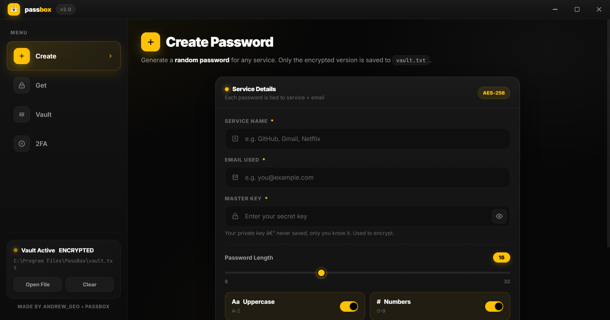

  

<h1 align="center">PassBox — MADE BY ANDREW_GEO — v2.0</h1>

Secure desktop password vault — Black • Yellow • White • AES-256 + 2FA

  
  
  

  <b>⬇ Download: <a href="https://github.com/Andrew-Geo1/PassBox/releases">install_passbox.exe</a> (178MB)</b> 
  One file → <code>C:\Program Files\PassBox\passbox.exe</code> + Desktop shortcut • vaults same folder

  

---

### Install
1. Download `install_passbox.exe`
2. Double-click → **Yes** (admin) → **Install PassBox**
3. Tutorial shows while installing

Installs to `C:\Program Files\PassBox\passbox.exe` + `PassBox.lnk`
- `vault.txt` — `SERVICE | EMAIL | ENCRYPTED`
- `vault_2fa.txt` — `SERVICE | EMAIL | ENCRYPTED_SECRET`

### How it works
**Create:** Service + Email + Master Key → Length 8-32 + toggles → **Generate & Encrypt & Save**

**Get:** Copy hex from `vault.txt` + Master Key → **Decrypt & Reveal**

**Vault:** Search, Copy / Decrypt / Delete, Show in Folder

**2FA NEW in v2:**
Add: Service + Email + Master Key + TOTP Secret (blank = auto) → `vault_2fa.txt`
Generate: Paste `Encrypted 2FA Secret` + `Master Key you used` only → 6-digit code, no spaces, 30s auto-refresh

### Security
AES-256-CBC + SHA256(key) + 16B IV, TOTP SHA1 30s. Master key never saved.

### Changelog v2.0
- Added 2FA vault
- Generate 2FA simplified to Encrypted + Master Key only
- 2FA code no spaces
- Installer tutorial updated for 2FA

---

<b>© PassBox • Made by Andrew_Geo • v2.0</b>

