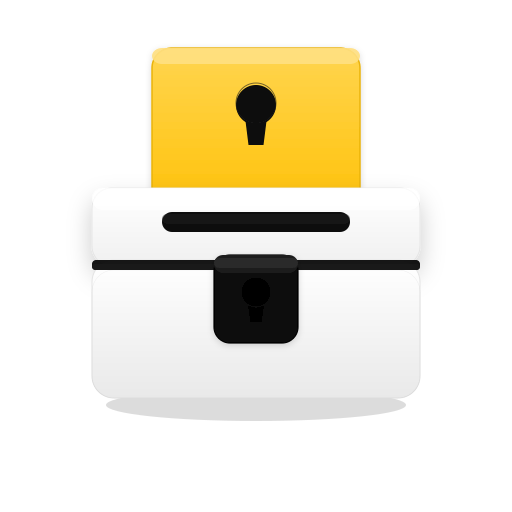

<p align="center">
  
</p>

<h1 align="center">PassBox — Windows Source Code — v2.0</h1>
<p align="center"><b>MADE BY ANDREW_GEO</b> • Electron • Black / Yellow / White • AES-256 + TOTP 2FA</p>

This is the complete working source of the PassBox **Windows desktop app v2.0** (`passbox.exe`).

### Run from source
```bash
npm install
npm start
```

### Build portable exe
```bash
npx electron-packager . PassBox --platform=win32 --arch=x64 --out=dist --overwrite --icon=icon.ico --app-version=2.0.0 --executable-name=passbox
```
Output: `dist/PassBox-win32-x64/passbox.exe` — vault files (`vault.txt`, `vault_2fa.txt`) are created next to the exe.

### Files (source only)
| File | Purpose |
|---|---|
| `main.js` | Electron main — window, AES-256-CBC crypto, password gen, TOTP, vault I/O |
| `preload.js` | Secure IPC bridge (`window.passbox`) incl. 2FA |
| `index.html` | UI — Create / Get / Vault / 2FA pages |
| `renderer.js` | UI logic — toggles, strength, decrypt, 2FA countdown |
| `style.css` | Black `#070707` / Yellow `#FFC107` / White theme |
| `package.json` | `passbox@2.0.0`, Electron 33 |
| `icon.png` / `icon.ico` | Transparent safe icon |
| `vault.txt` / `vault_2fa.txt` | Vault templates (`SERVICE \| EMAIL \| ENCRYPTED`) |

### Features
- **Create:** Service + Email + Master Key → length 8–32 + toggles → random password → AES-256 encrypted → `vault.txt` (same folder as exe)
- **Get:** Encrypted + Master Key → real password
- **2FA:** Add Service + Email + Master + TOTP secret (blank = auto) → `vault_2fa.txt`; Generate with **Encrypted + Master Key only** → 6-digit code, no spaces, 30s auto-refresh
- **Vault:** search, copy, decrypt, delete, pull stats; master key never saved

### Security
AES-256-CBC + SHA256(master key) + 16-byte random IV per entry (`iv:cipher` hex). TOTP: HMAC-SHA1, 30s, 6 digits. Wrong key → `bad decrypt`.

---
<p align="center"><b>© PassBox • Made by Andrew_Geo • v2.0</b></p>
